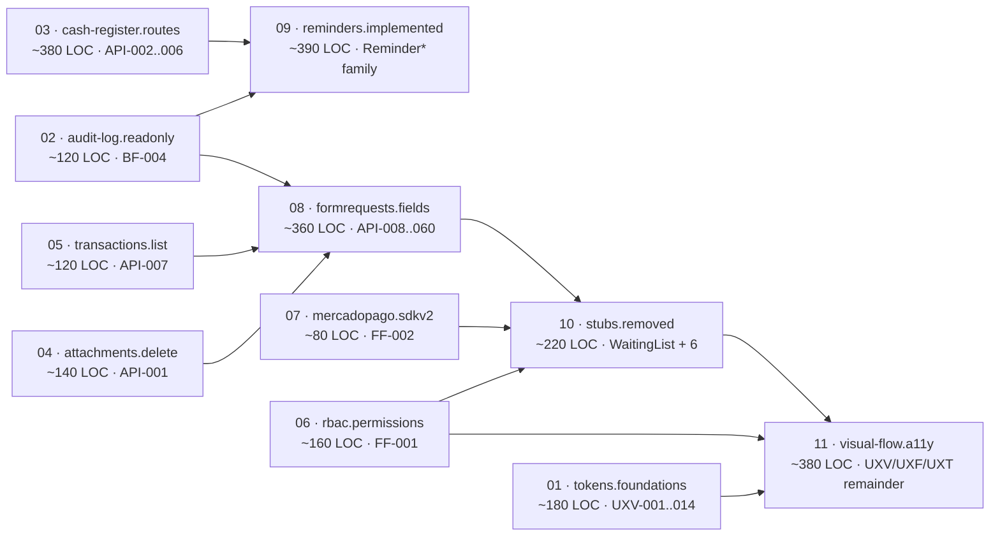
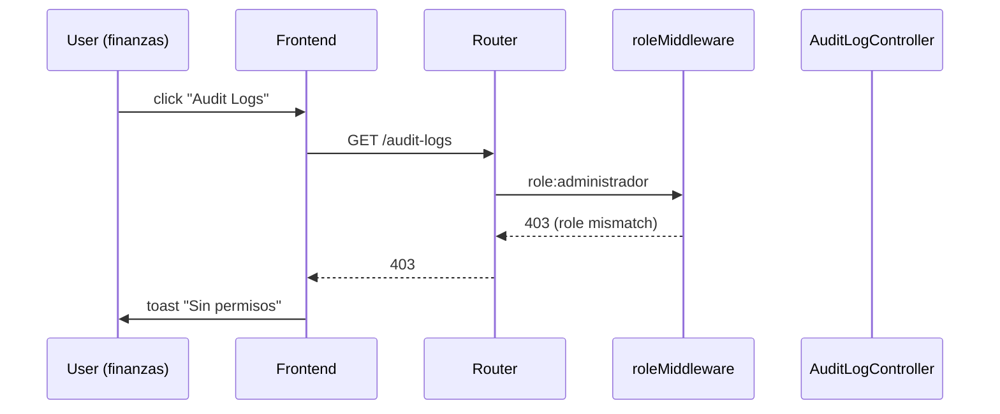
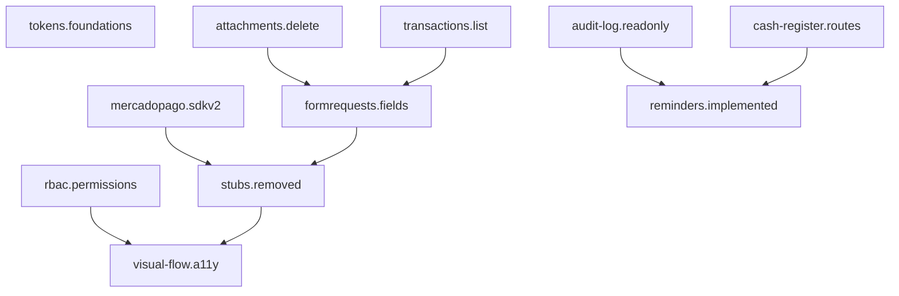

# Design — bugfix-2026-08

> Status: in-review · Artifact store: hybrid · Delivery strategy: ask-on-risk · Review budget: 400 lines/slice
> Stack: Laravel 12 + Vue 3.3 + Tailwind 3.3 + Sanctum 4 + Reverb 1.6 + MySQL 8.0 · Strict TDD

## 1. Architecture overview

### 1.1 Slice pipeline (Mermaid)



Ordering rationale (per proposal §"Slicing Strategy"): pure-infrastructure slices first (tokens, audit-log, routes), RBAC + SDK fixes before visual-flow, FormRequests mid-chain so per-endpoint tests use the new fields, stubs last so they ride on the new routing.

### 1.2 Layer impact

| Layer | Modifications |
|---|---|
| `routes/api.php` | Replace `apiResource('audit-logs')` with explicit GET pair; register 5 new cash-register endpoints; remove `waiting-lists` apiResource; remove 6 stub routes |
| Controllers (`app/Http/Controllers/Api/*`) | New `CashRegisterReportController` + `CashRegisterSummaryController`; implement `ReminderController`/`ReminderTemplateController`; add `MedicalRecordController::deleteAttachment`; delete `WaitingListController` + 6 stubs |
| FormRequests (`app/Http/Requests/*`) | Add nullable fields to 8 requests per spec 02 |
| Services (`app/Services/*`) | Reuse `ReminderService`, `CashRegisterService`, `CashRegisterReportService`, `TransactionService` — **no new abstractions** |
| Console (`app/Console/`) | Wire `ReminderProvider` in `routes/console.php` (Laravel 12 has no Kernel.php — confirmed via Glob); add `SddCheckMigrations` + `SddCheckEvents` commands |
| Models | None — migrations are additive-only |
| Migrations (`database/migrations/*`) | Optional: `audit_log_immutable` flag column (slice 2); all additive |
| Frontend composables | `useToast` reactivity fix (line 77), `useApi.del` body support, `usePermissions.createMovement` exposure, `useMercadoPago` dead-call drop, `useNotifications` SSR guard |
| Frontend components | `Modal.vue` focus-trap + Escape-on-document; `PaymentModal.vue` 401 surfacing; 14 modal callers standardized |
| Design tokens | New `resources/js/design-system/tokens.js`; `tailwind.config.js` palette re-sourced |
| Tests | New Feature/Unit per slice; no JS unit runner (lint+format gates only) |

## 2. Per-slice design

### Slice 01 — `tokens.foundations` (UXV-001..014)

- **Files affected**
  - NEW `resources/js/design-system/tokens.js` (canonical tokens)
  - MOD `tailwind.config.js` (palette re-sourced from tokens)
  - MOD 14 components using hex literals (search by `#[0-9a-f]{6}` in `.vue`)
  - MOD `resources/js/design-system/.gitkeep` (delete; file replaces it)
- **Backend**: none.
- **Frontend**: tokens exported as ESM constants; Tailwind config imports them via Vite alias. New lint rule `no-restricted-syntax` forbids hex literals outside tokens.
- **Migrations**: none.
- **Test strategy**: snapshot test `tests/visual/tokens.test.mjs` (Node) + pnpm build. CI doc-link check validates `AGENTS.md → tokens.js` resolves.

### Slice 02 — `audit-log.readonly` (BF-004)

- **Files affected**
  - MOD `routes/api.php` (replace `apiResource` with `Route::get('audit-logs', ...)` + `Route::get('audit-logs/{id}', ...)`; move audit group under `role:administrador`)
  - MOD `app/Http/Controllers/Api/AuditLogController.php` (no code change — index/show already exist; remove unused `byX` imports if no consumer)
  - NEW `database/migrations/2026_08_xx_add_audit_log_immutable.php` (additive `boolean is_immutable` nullable column)
- **Backend**: routes only — controllers already implement index/show + byX filters. byX actions remain but only callable by admin.
- **Migrations**: `add_audit_log_immutable` — single nullable boolean column, no destructive ALTER.
- **Sequence diagram**: see §3.4 RBAC.
- **Test strategy**: `tests/Feature/Api/AuditLogControllerTest.php` — 200 for GET, 405/404 for POST/PUT/PATCH/DELETE; role:admin gate per spec 09.

### Slice 03 — `cash-register.routes` (API-002..006)

- **Files affected**
  - NEW `app/Http/Controllers/Api/CashRegisterSummaryController.php` (`summary()` only)
  - NEW `app/Http/Controllers/Api/CashRegisterReportController.php` (`closureReport()`, `period()` moved from `CashReportController`)
  - MOD `app/Http/Controllers/Api/CashRegisterController.php` (add `movements($id)`)
  - MOD `app/Http/Controllers/Api/Reports/ReportController.php` (add `export($reportType, Request)` with format whitelist)
  - MOD `routes/api.php` (register 5 new routes; `summary`/`closureReport`/`sessions/{id}` BEFORE `apiResource` to avoid shadow)
- **Backend**: Reuses `CashRegisterService`, `CashRegisterReportService`. Response shape `{data, meta.message}` enforced.
- **Migrations**: none.
- **Sequence diagram** (cash-register summary):
  ```mermaid
  sequenceDiagram
    Front->>API: GET /cash-register/summary
    API->>CashSession: resolve active session
    CashSession->>CashMovement: aggregate
    CashMovement-->>API: totals
    API-->>Front: {data, meta.message}
  ```
- **Test strategy**: `CashRegisterSummaryTest.php`, `CashRegisterSessionDetailTest.php`, `CashRegisterClosureReportTest.php`, `ReportsExportTest.php` (200/400), `ReportsPeriodTest.php`.

### Slice 04 — `attachments.delete` (API-001)

- **Files affected**
  - MOD `app/Http/Controllers/Api/MedicalRecordController.php` (add `deleteAttachment(Request, $id)`)
  - MOD `routes/api.php` (`Route::delete('medical-records/attachments/{id}', ...)` inside clinical role group)
- **Backend**: Reuses `MedicalRecordAttachment` model + existing storage service. Returns 204 on success, 403 on RBAC failure, 404 if not found.
- **Migrations**: none.
- **Test strategy**: `MedicalRecordAttachmentTest.php` — 204/403/404.

### Slice 05 — `transactions.list` (API-007)

- **Files affected**
  - MOD `routes/api.php` (declare `Route::get('transactions/list', ...)` BEFORE `Route::middleware('cash.session')->apiResource('transactions', ...)`)
- **Backend**: `TransactionController@list` delegates to `TransactionService::paginateCurrentSession()`. Pure reorder; controller already implements `index()`.
- **Migrations**: none.
- **Test strategy**: `TransactionsListTest.php` — requires open cash session; 200 with `{data, meta}`.

### Slice 06 — `rbac.permissions` (FF-001)

- **Files affected**
  - MOD `resources/js/composables/usePermissions.js` (add `createMovement`, `voidMovement`, `editMovement`; declare `isClinical`/`isFinanzas`/`isAdministrador` BEFORE the `can` object — current declaration order creates confusing readability)
  - NEW `scripts/build/permissions-generator.mjs` (Node script reads `routes/api.php` middleware groups, emits `permissions.snap.json`)
  - NEW `tests/build/permissions.snap.test.js` (snapshot test)
- **Backend**: none — backend role guard at `routes/api.php:376` already correct.
- **Migrations**: none.
- **Sequence diagram** (RBAC capability check):
  ```mermaid
  sequenceDiagram
    Comp->>useAuth: read user.role
    useAuth-->>Comp: 'finanzas'
    Comp->>usePermissions: can.createMovement.value
    usePermissions-->>Comp: true
    Comp->>API: POST /cash-movements
    API->>roleMiddleware: role:administrador,finanzas
    roleMiddleware-->>API: pass
    API->>CashMovementService: store
    API-->>Comp: 201 {data, meta.message}
  ```
- **Test strategy**: `tests/composables/usePermissions.spec.js` (vitest OR jsdom via `@vue/test-utils` — confirm runner in apply; fall back to manual matrix). Snapshot test enforces parity with `routes/api.php`.

### Slice 07 — `mercadopago.sdkv2` (FF-002)

- **Files affected**
  - MOD `resources/js/composables/useMercadoPago.js` (line 39: remove `window.MercadoPago.setPublishableKey(publicKey)`; SDK v2 picks public key from the brick `settings` or it's omitted — preferenceId is the source of truth)
- **Backend**: none.
- **Migrations**: none.
- **Test strategy**: build check (script compiles). Manual smoke: open `PaymentModal`, observe brick renders without `setPublishableKey is not a function` console error.

### Slice 08 — `formrequests.fields` (API-008..060 high subset)

- **Files affected**
  - MOD `app/Http/Requests/StoreAppointmentRequest.php` (add `procedure_id`, `treatment_plan_id`, `branch_id`, `ends_at` all nullable; add `after:starts_at` validator for `ends_at` when present)
  - MOD `app/Http/Requests/UpdateAppointmentRequest.php` (add `ends_at` nullable)
  - MOD `app/Http/Requests/StoreQuotationRequest.php` (add `procedure_id`, `payment_method_id`)
  - MOD `app/Http/Requests/StoreTransactionRequest.php` (add `payment_method_id`)
  - MOD `app/Http/Requests/StoreTreatmentPlanRequest.php` (add `branch_id`)
  - MOD `app/Http/Requests/StoreCashMovementRequest.php` (add `branch_id`; add `concept` whitelist per spec 02)
  - MOD `app/Http/Requests/StoreSpecialtyRecordRequest.php` (add `procedure_id`)
  - NEW `tests/Feature/Api/FormRequestFieldsTest.php` (parameterized)
  - NEW `tests/Feature/Api/CashMovementValidationTest.php` (concept whitelist)
- **Backend**: no controller changes. Existing 3 non-migrable FormRequests (StoreAppointmentRequest, StoreQuotationRequest, StoreSpecialtyRecordRequest) keep their inline validation — only ADD nullable fields. **Decision per proposal**: do NOT refactor controllers; extend rules.
- **Migrations**: none.
- **Test strategy**: per-FormRequest validation test with happy path (null fields OK) and one 422 case per new field. Localization: assert `meta.locale: "es"`.

### Slice 09 — `reminders.implemented` (ReminderController, ReminderTemplateController, ReminderProvider)

- **Files affected**
  - MOD `app/Http/Controllers/Api/ReminderController.php` (implement `index`/`store`/`show`/`update`/`destroy` via `ReminderService`; keep existing `send`)
  - MOD `app/Http/Controllers/Api/ReminderTemplateController.php` (full CRUD; auth `role:administrador`)
  - MOD `routes/console.php` (wire `Schedule::call(...ReminderProvider)` hourly)
  - NEW `tests/Feature/Api/ReminderControllerTest.php`
  - NEW `tests/Feature/Api/ReminderTemplateControllerTest.php`
  - NEW `tests/Integration/ReminderProviderTest.php` (Bus::fake, ClockFake)
  - NEW `tests/Unit/ReminderScheduleStateTest.php`
- **Backend**: Reuses `ReminderService`. Status machine `pending → queued → sent|failed` enforced in service. Channel whitelist `['sms','email','whatsapp','push']` → 422 on unknown.
- **Migrations**: optional new `reminder_provider_runs` table (idempotency, last-run timestamp). Additive only.
- **Sequence diagram** (ReminderProvider scheduled run):
  ```mermaid
  sequenceDiagram
    Console->>Provider: hourly trigger
    Provider->>ReminderService: dispatchPending
    ReminderService->>ReminderSchedule: where(status=pending, send_at<=now)
    ReminderService-->>Provider: queued
    Provider->>ReminderService: send
    ReminderService-->>Channel: external API
    Channel-->>ReminderService: ok|err
    ReminderService-->>Provider: status=sent|failed
  ```
- **Test strategy**: feature + integration; assert listener isolation (see §3.5).

### Slice 10 — `stubs.removed` (WaitingList + 6)

- **Files affected**
  - DELETE `app/Http/Controllers/Api/WaitingListController.php`
  - DELETE `app/Services/WaitingListService.php` (verified orphaned via Grep — only `WaitingListController::store` calls `addToWaitingList`)
  - DELETE `app/Models/WaitingList.php` (verify no FK references via migration diff)
  - DELETE `app/Events/WaitingListCreated.php`
  - DELETE `app/Events/WaitingListFilled.php`
  - DELETE 6 low-priority stub controllers (per-file triage in apply; each ≤50 LOC)
  - MOD `routes/api.php` (remove `Route::apiResource('waiting-lists', ...)` and 6 stub registrations)
  - NEW `openspec/changes/bugfix-2026-08/findings-map.md` (removal manifest)
- **Backend**: pre-remove `grep -r "waiting-list" resources/js/ tests/Feature/` gate in apply (abort if consumer found — confirmed absent in current tree).
- **Migrations**: none — `WaitingList` model removal requires nullable FK backfill; per AGENTS.md §6 this is a documented deletion, no schema change required if no FK in other tables (verify in apply).
- **Test strategy**: 404 assertions on removed routes; `git log` per-stub commits for surgical rollback.

### Slice 11 — `visual-flow.a11y` (UXV/UXF/UXT remainder, 37 items)

- **Files affected**
  - MOD `resources/js/components/ui/Modal.vue` (focus trap; Escape listener on `document`; return-focus on close)
  - MOD 13 caller modals (verify `closeOnEscape` + `role="dialog"`)
  - MOD `resources/js/components/PaymentModal.vue` (surface 401 `data.message` + `meta.message`)
  - MOD `resources/js/composables/useApi.js` (`del(url, {data})` accepts body via fetch options)
  - MOD 11 list views (EmptyState component)
  - NEW `resources/js/components/ui/EmptyState.vue`
  - NEW `resources/js/components/ui/SkeletonList.vue`
  - NEW `resources/js/components/ui/ConfirmDialog.vue`
- **Backend**: none.
- **Migrations**: none.
- **Sequence diagram** (focus trap):
  ```mermaid
  sequenceDiagram
    User->>Modal: Tab
    Modal->>Modal: getFocusable()
    Modal->>firstFocusable: focus
    User->>Modal: Tab
    Modal->>nextFocusable: focus
    User->>Modal: Shift+Tab
    Modal->>prevFocusable: focus
    User->>Modal: Tab on last
    Modal->>firstFocusable: wrap
  ```
- **Test strategy**: vitest/jsdom for `Modal.spec.js`, `ConfirmDialog.spec.js`; axe-core scan for WCAG 2.1.1; `useApi.spec.js` for body-on-del.

## 3. Cross-cutting decisions

### 3.1 Event wiring (Slice 09 + 10)

`AppServiceProvider::boot()` currently wires 7 listeners for 10 events. Slice 09 adds `ReminderSent` listener registration when ReminderController dispatches it. Slice 10 deletes 26 deprecated event classes — verify before deletion that no `event(new WaitingListCreated(...))` call site remains outside the deletion target (Grep gate in apply).

New wiring pattern (slice 09):
```php
\Illuminate\Support\Facades\Event::listen(
    \App\Events\ReminderSent::class,
    \App\Listeners\TrackReminderDelivery::class
);
```
Listener MUST wrap its body in try/catch and `report()` failures (per AGENTS.md §7 — events wrapped in try/catch). Failing listener MUST NOT propagate to the request.

### 3.2 Permission model (Slice 06)

`createMovement` is added to `usePermissions.js` with roles `['administrador', 'finanzas']` — matches the backend middleware at `routes/api.php:366`. Hardening via auto-generated snapshot from `routes/api.php` middleware groups ensures no drift.

### 3.3 API response contract (`{data, meta.message}`)

Per AGENTS.md §7: every controller returns `{data: ..., meta: {message: '...'}}`. Endpoints touched by slice 03/05 standardized explicitly. Composables consuming `response.data` and `response.meta` are already shaped correctly (verified `useTransactions.js` lines 24-25). Spec 01 requires `meta.locale: "es"` for validation failures — implemented in FormRequests via `messages()` override + custom JSON response.

### 3.4 RBAC sequence (audit-log admin-only)



### 3.5 State handling (Slice 11, 08)

- **useToast reactivity fix** (`resources/js/composables/useToast.js:77`): change `toasts: toasts.value` → `toasts` (the Ref itself) so consumers receive a reactive array. Verify `globalToasts` export remains the Ref (already correct at line 89).
- **useApi.del body support**: add `options.data` parameter, serialize as JSON when not FormData. Backwards-compatible: existing no-body callers unaffected.
- **useEcho init timing**: confirmed `useEcho.js` initializes at module load if `window` exists. Spec 08 requires post-login init. Fix: wrap init inside `useAuth().isAuthenticated` watcher; defer until login.
- **useCashRegister doble suscripción**: spec 08 mentions this — fix via composable-internal `onUnmounted` cleanup + singleton `eventBus`.
- **useNotifications SSR guard**: add `typeof window !== 'undefined'` checks before `localStorage` reads (already partially in place at lines 10-18; full guard at line 33 `loadFromStorage()`).

### 3.6 Design tokens

`tokens.js` publishes canonical `colors`/`spacing`/`radius`/`typography`/`shadow`/`breakpoint` objects. `tailwind.config.js` reads tokens via `import { tokens } from './resources/js/design-system/tokens.js'` (Vite alias). `info`/`neutral` tokens: include only tokens with active consumers (audit during apply; prune unused to keep build small). `/opacity` exposure: tokens include `opacity: { 0, 5, 10, 20, ..., 100 }` to avoid Tailwind default bypass.

### 3.7 Accessibility

- Modals: focus-trap + Escape-on-document + return-focus-on-close
- Forms: `aria-required="true"` on required fields (additive)
- Pagination: `role="navigation"` + `aria-label="Paginación"`
- Buttons: explicit `aria-expanded` on disclosure toggles

### 3.8 FormRequest strategy for non-migrable controllers

Per proposal: **extend rules, do NOT refactor controllers**. Spec 02 already constrains scope to nullable additions. `StoreAppointmentRequest` keeps its inline `scheduled_at` validator + adds nullable `procedure_id`/`treatment_plan_id`/`branch_id`/`ends_at`. `StoreQuotationRequest` keeps `patient_id` requirement and adds nullable `procedure_id`/`payment_method_id`. `StoreSpecialtyRecordRequest` keeps its 14 inline fields and adds nullable `procedure_id`. Controller refactor explicitly out of scope.

### 3.9 Migration drift (Slice 05 + CI guard)

Per AGENTS.md §6 the 28 SQLite failures are documented tech debt. **Decision**: leave untouched. New migrations in this change are additive-only — CI gate `tests/Unit/SddCheckMigrationsTest.php` parses pending migrations and rejects DROP COLUMN / MODIFY COLUMN with type change / non-nullable without default.

### 3.10 Audit log apiResource → explicit routes (Slice 02 + 09)

```php
// BEFORE (routes/api.php:238)
Route::apiResource('audit-logs', AuditLogController::class);

// AFTER
Route::middleware('role:administrador')->group(function () {
    Route::get('audit-logs', [AuditLogController::class, 'index']);
    Route::get('audit-logs/{id}', [AuditLogController::class, 'show']);
    // byX filters retained for v2 (admin-only)
    Route::get('audit-logs/patient/{patientId}', [AuditLogController::class, 'byPatient']);
    // ...
});
```
Avoids the 500 because Laravel no longer dispatches POST/PUT/PATCH/DELETE to non-existent methods.

## 4. Dependency graph (slices)



Blocking relations: S06 blocks S11 (visual flow reads `usePermissions.can.*`); S02 blocks S09 (reminder tests must pass on audit-clean baseline); S08 blocks S10 (stub removal must not break FormRequest consumers).

## 5. Risk register + mitigations

| Risk | Severity | Mitigation |
|---|---|---|
| Stub removal breaks hidden frontend consumer | High | Pre-remove `grep -r` across `resources/js/` + `tests/Feature/Api/` per stub; abort if hit |
| SDK MP v2 method removal breaks `PaymentModal` | Medium | Manual smoke in apply; confirm brick renders without `setPublishableKey is not a function` |
| FormRequest additive fields break existing payloads | Medium | All new fields nullable; old payloads persist identical to pre-change |
| Modal focus trap conflicts with FullCalendar | Medium | Trap scoped to `role="dialog"`; FullCalendar lives outside |
| tokens.js palette diverges from `tailwind.config.js` | Low | Snapshot test + build gate |
| `useToast` reactivity fix breaks existing consumers | Medium | Grep `useToast().toasts` callers in apply; manual a11y pass |
| `WaitingList` model deletion cascades via FK | Medium | Migration diff in apply; backfill NULL before DROP COLUMN if needed (none expected) |
| Cash-register summary duplicates `CashReportController::period()` | Low | Slice 03 keeps both — `summary` = current-shift aggregate, `period` = date-range. Different semantics |
| SQLite-local pre-existing 28 failures vs CI MySQL | Low | Out of scope; CI gate stays MySQL |
| RBAC snapshot drift after manual route edit | Low | `pnpm rbac:check` CI step fails build on mismatch |
| Composer dev script uses `pnpm dev` — verify | Low | AGENTS.md §3 already documents; no change needed |

## 6. Rollback plan per slice

| Slice | Rollback |
|---|---|
| 01 tokens | `git revert`; delete `tokens.js`; consumers fall back to inline classes |
| 02 audit-log | `git revert`; restore `apiResource`; admin-only middleware revert |
| 03 cash-register | `git revert`; controllers + routes dropped; no migration to undo |
| 04 attachments | `git revert`; delete route + method |
| 05 transactions.list | `git revert`; pure reorder |
| 06 rbac | `git revert`; revert composable |
| 07 MP SDK | `git revert`; revert `useMercadoPago.js` |
| 08 formrequests | `git revert`; additive-only — no migration to undo |
| 09 reminders | `git revert`; controllers + scheduled provider reverted |
| 10 stubs.removed | `git revert`; per-stub commits enable surgical restore |
| 11 visual-flow | `git revert`; modals + composables reverted |

All migrations are ADD COLUMN nullable → safe to leave in place on rollback (no destructive state).

## 7. Open questions

1. **`WaitingListService::addToWaitingList` orphan**: Grep confirmed only `WaitingListController::store` calls it. After controller removal, the service is orphaned. **Confirm**: delete service + WaitingList model + WaitingListCreated/Filled events in slice 10? (recommended)
2. **Console Kernel**: `app/Console/Kernel.php` does NOT exist (Laravel 12 uses `routes/console.php`). Slice 09 wires ReminderProvider in `routes/console.php` — confirm this is acceptable (recommended; matches Laravel 12 idiom).
3. **Frontend test runner**: `openspec/config.yaml` declares `js_unit_runner: none`. Slices 06/11 want vitest/jsdom for composable+component tests. **Confirm**: add vitest in slice 11 (recommended; small dev-dep) or skip unit tests and rely on lint+manual a11y?
4. **AGENTS.md §6 says 10 events have listeners** (7 listener classes). Slice 10 wants to delete 26 deprecated events. Confirm via Grep in apply that all 26 are truly orphaned before deletion.
5. **JS unit test runner install scope**: if approved, vitest config goes in `vitest.config.js` + `package.json` script. Slice 11 or separate slice?

---

## Cross-references

- Proposal: `openspec/changes/bugfix-2026-08/proposal.md`
- Specs: `openspec/changes/bugfix-2026-08/specs/01..11-*.md`
- Init context: Engram #261 (sdd-init/odontosuite)
- AGENTS.md: §3 (commands), §6 (estado/tech debt), §7 (conventions)
- CodeGraph: `.codegraph/codegraph.db` (19.9 MB) — verify blast radius per slice
