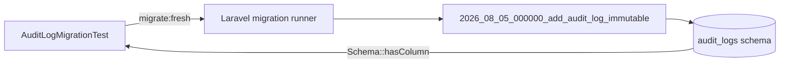
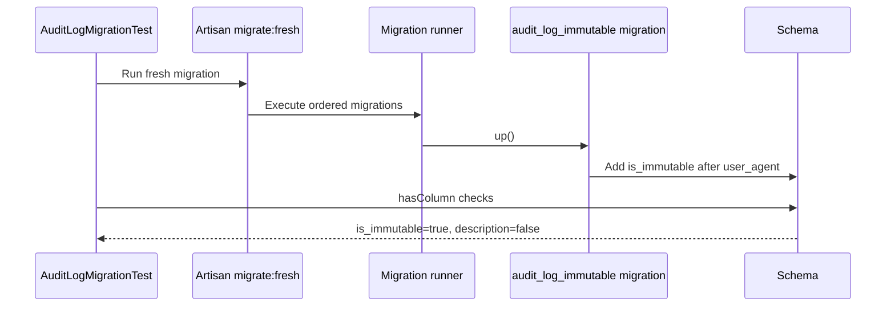
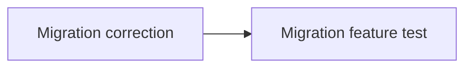

# Design: Immutable Audit Log Migration Hotfix

## 1. Architecture overview

This is an isolated database-migration correction: one existing migration is modified, one feature test is created, and no dependencies are added. The Laravel migration remains the schema owner; the test exercises the real migration pipeline and verifies the resulting schema through `Schema`.

## 2. Per-change design

**File affected**: `database/migrations/2026_08_05_000000_add_audit_log_immutable.php`

**Change**: Replace `->after('description')` with `->after('user_agent')`, preserving the nullable boolean type, default `false`, and existing `down()` behavior.

**Justification**: `user_agent` exists in `database/migrations/2025_09_20_082400_create_audit_logs_table.php` as nullable `text`. It is the last domain-specific payload column before framework timestamps and is therefore a stable base-schema anchor. The base schema contains neither `description` nor `metadata`.

**Test strategy**: Create `tests/Feature/Api/AuditLogMigrationTest.php` following the repository's Laravel feature-test conventions and using `tests/Unit/SddCheckMigrationsTest.php` as the migration-guard reference. Under the configured MySQL gate, it will verify:

- `Schema::hasColumn('audit_logs', 'is_immutable')` is `true` after migration.
- `Schema::hasColumn('audit_logs', 'description')` is `false` as a regression guard.
- `php artisan migrate:status` exits successfully and reports the target migration without errors.

Strict TDD ordering is RED first against the broken anchor, then the one-line migration correction, followed by focused and full migration verification.

**Migration ordering**: N/A — the existing timestamp already places the migration after the base `audit_logs` table migration.

## 3. Cross-cutting decisions

| Decision | Choice | Rejected alternative | Rationale |
|---|---|---|---|
| Migration correction | Correct the unreleased migration in place | Add a corrective migration | Clean setups fail before this migration completes, so there is no released schema contract to preserve. An extra migration would add ordering and recovery complexity without repairing clean installs. |
| Abstraction boundary | Use Laravel `Schema` and Artisan directly | Add a migration helper or schema inspector | The change has one anchor and one schema assertion; a new abstraction would add maintenance without reuse. |
| Test consistency | Reuse `SddCheckMigrationsTest` conventions as reference | Introduce a separate migration-test framework | Existing guard naming and migration policy remain consistent while the new feature test adds runtime coverage. |

No routing, shell integration, subprocess orchestration, VCS automation, executable classification, or process-integration boundary is introduced; the threat matrix is not applicable.

## 4. Dependency graph

External dependencies: **0**. The change is isolated to Laravel's existing migration and testing facilities.

## 5. Risk register

| Risk | Severity | Mitigation |
|------|----------|------------|
| Partial apply on a developer machine | Very low | Inspect migration state first. If recorded, run `php artisan migrate:rollback --step=1`; if the column exists but the migration is unrecorded, run `ALTER TABLE audit_logs DROP COLUMN is_immutable` before re-migrating. Do not execute both cleanup paths blindly. |
| Test does not detect a future regression | Low | Combine positive and negative `Schema::hasColumn` assertions with a successful `migrate:status` check. |

## 6. Rollback plan

- Revert the hotfix commit with `git revert <commit>`; this reverses the one modified migration and removes the added test.
- If the migration is already recorded as applied, run `php artisan migrate:rollback --step=1` before reverting.
- For an unrecorded partial application only, run `ALTER TABLE audit_logs DROP COLUMN is_immutable`, then restore or re-run migrations.

Apply commit convention: `fix(migrations): audit_log_immutable column placement + portability test`.

## 7. Open questions

None. The schema anchor, test boundary, migration ordering, and recovery paths are resolved.
